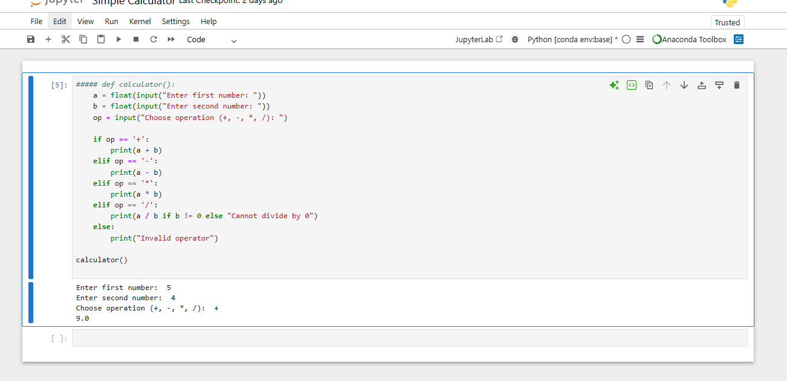

# 🧮 Simple Calculator
This is a beginner-friendly Python project that performs basic arithmetic operations: addition, subtraction, multiplication, and division. The calculator takes two numerical inputs from the user and applies the selected operation.
It includes error handling for:
- Division by Zero
---
## 💡 Features
- Handles four basic operations
- Prevents division by zero
---
## 🧠 Concepts used
- Python basics
- 'input()','print()'
- Basic function and conditional statements
---
## 📷 Sample output

